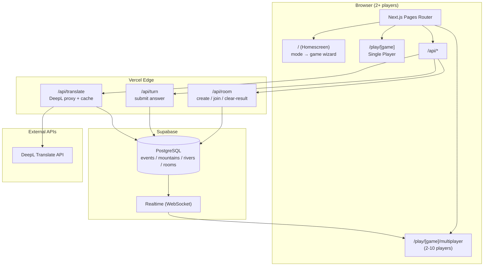
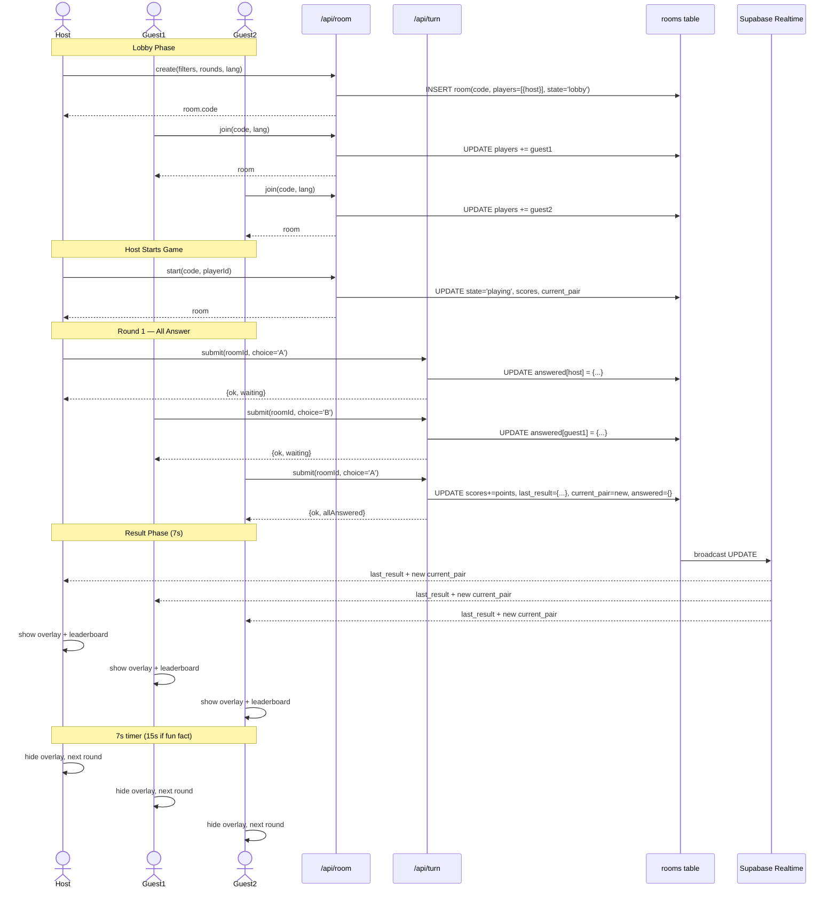
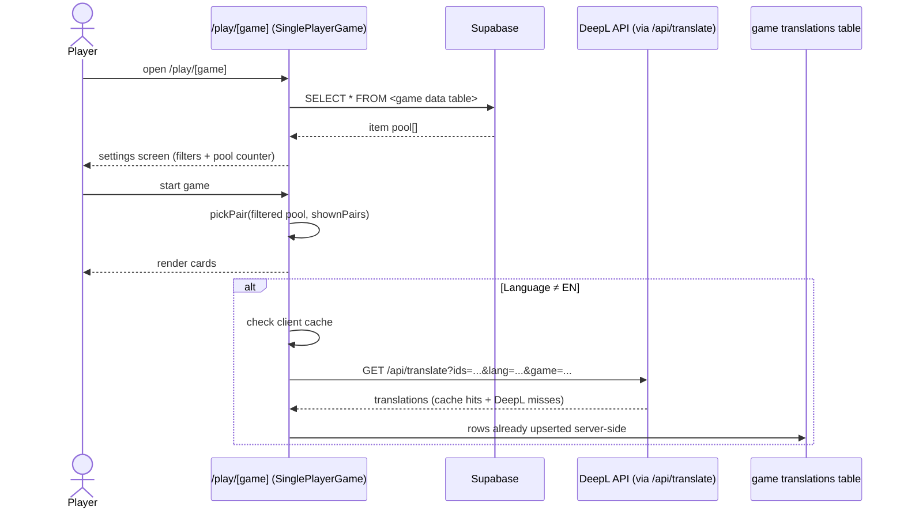
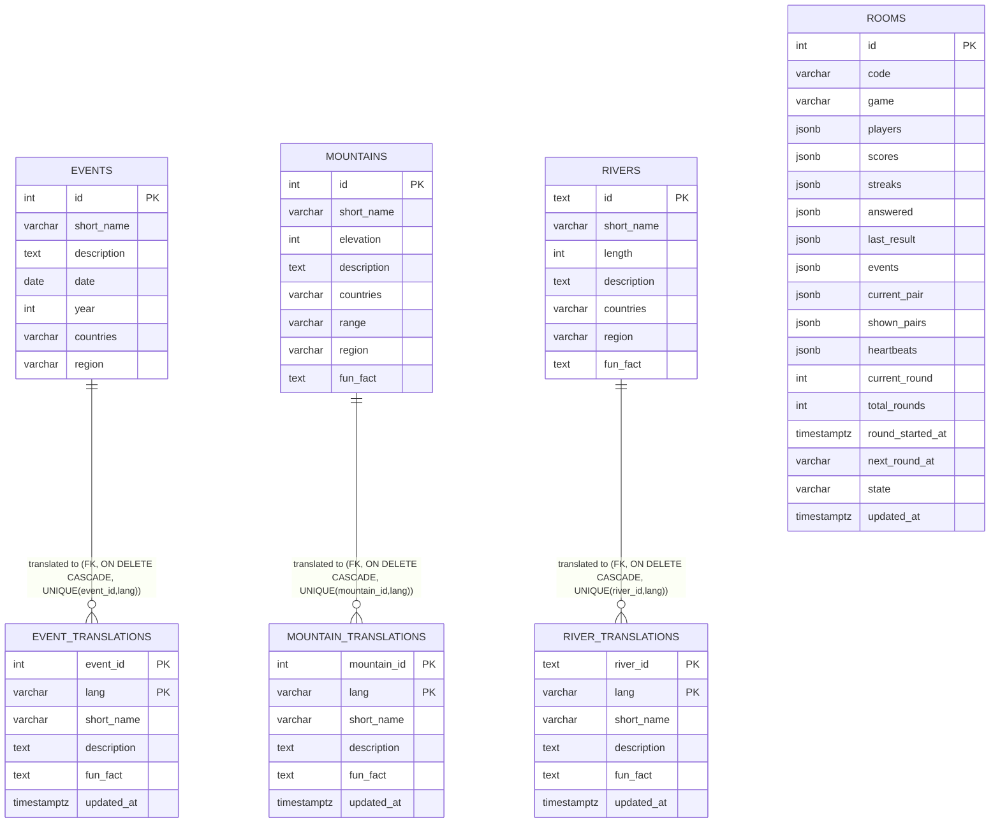
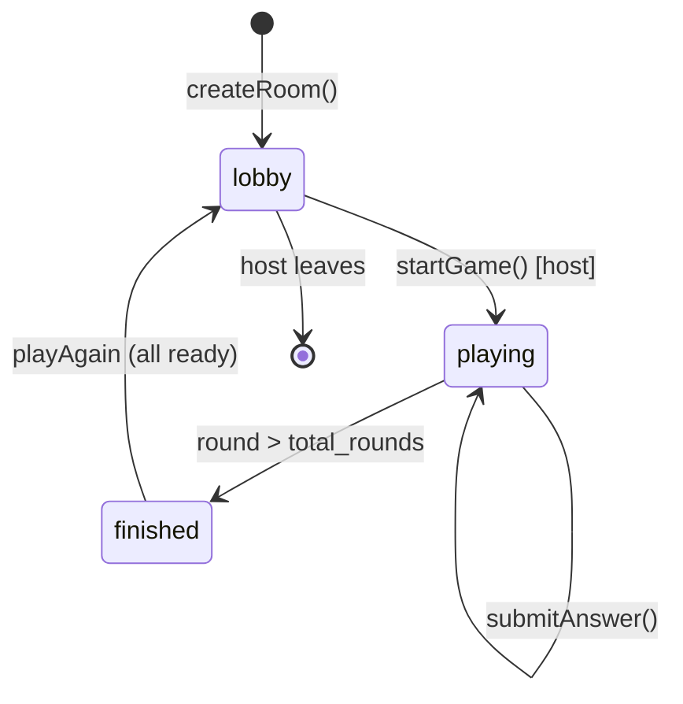
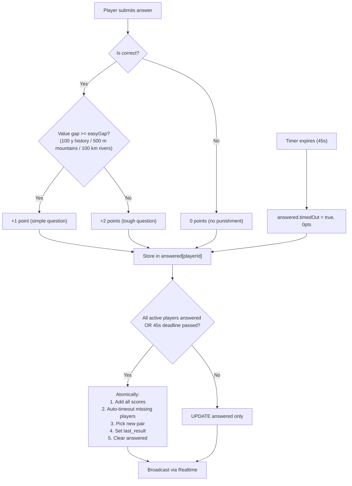
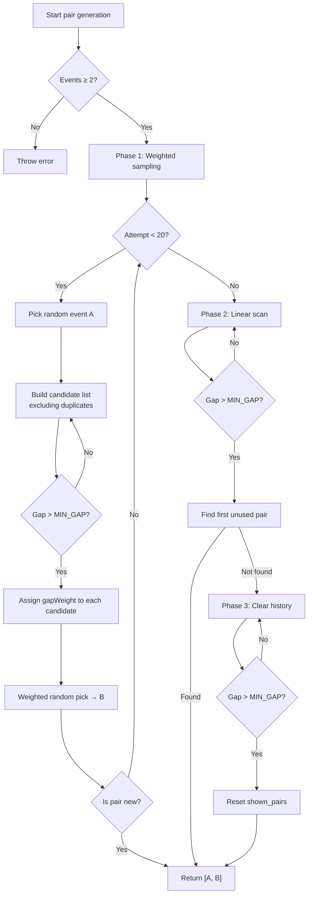
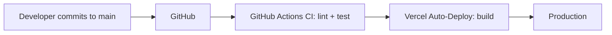

# Higher or Lower Games — Architecture

## System Overview



---

## Game Registry (`lib/games.js`)

Every game is fully described by one entry in the `GAMES` registry. All pages, APIs and components read their game-specific behaviour from it — adding a new game means adding one registry entry plus one data table.

| Config | History | Mountains | Rivers | Used by |
|--------|---------|-----------|-------|---------|
| `data.table` | `events` | `mountains` | `rivers` | room create, translate, SP/MP data load |
| `data.translationsTable` | `event_translations` | `mountain_translations` | `river_translations` | `/api/translate` |
| `data.translationFkColumn` | `event_id` | `mountain_id` | `river_id` | `/api/translate` |
| `mechanics.getValue` | year | elevation | length (km) | pairing, scoring, filters |
| `mechanics.getComparable` | date-aware time | elevation | length (km) | winner comparison |
| `mechanics.direction` | `lower` (earlier wins) | `higher` (taller wins) | `higher` (longer wins) | `pickWinner()` in turn.js |
| `mechanics.minGap` | 2 years | 50 m | 10 km | pickPair exclusions |
| `mechanics.gapScale` | 50 | 500 | 500 | proximity weight decay |
| `mechanics.easyGap` | 100 y → +1 pt | 500 m → +1 pt | 100 km → +1 pt | scoring (+2 below) |
| `filters.range` | `startYear`/`endYear` | `minElevation`/`maxElevation` | `minLength`/`maxLength` | SettingsPanel, Lobby, room create |
| `filters.group` | `region` (UN M49, grouped) | `region` (UN M49, grouped) | `region` (UN M49, grouped) | SettingsPanel, Lobby, room create |

Per-game UI dictionaries live in `lib/gameUi.js` (`SP_UI`, `MP_UI` — keys verified identical across en/cs/it by tests).

---

## Multiplayer Data Flow


```

---

## Single-Player Data Flow



---

## Database Schema



`rooms.game` (`'history'` | `'mountains'` | `'rivers'`, default `'history'`) determines which mechanics apply to the room's pairs — comparison direction, scoring gaps and the fun_fact source table. The room's `events` JSONB pool holds rows from the corresponding data table.

---

## Room State Machine



---

## Turn.js Scoring Logic



| Scenario | History gap | Mountains gap | Rivers gap | Correct Points | Wrong Points | Timed Out |
|----------|-------------|----------------|-------------|---------------|--------------|-----------|
| Simple question | ≥ 100 years | ≥ 500 m | ≥ 100 km | +1 | **0** | **0** |
| Tough question | < 100 years | < 500 m | < 100 km | +2 | **0** | **0** |

---

## Event Pairing Algorithm (`pickPair.js`)

The game generates pairs of items (events / mountains / rivers) for each round. Items that are **closer in value** (year / elevation / length) are preferred, but with a **hard minimum gap** — items too close together are completely excluded from pairing. This prevents ambiguous "too-close-to-call" rounds while still favoring challenging pairs over easy ones.

### Minimum Gap Rule

```
History:  MIN_GAP_YEARS = 2       (pairs ≤ 2 years apart never shown)
Mountains: MIN_GAP_METERS = 50    (pairs ≤ 50 m apart never shown)
Rivers:   MIN_GAP_KM = 10         (pairs ≤ 10 km apart never shown)
```

Any candidate where `gap <= minGap` is **rejected immediately** before weight calculation. This applies to **all three** generation phases (weighted sampling, linear scan fallback, and nuclear fallback).

### Weight Function

After filtering out too-close candidates, the selection uses a **proximity-weighted random sample**. The weight for a remaining candidate is:

```
weight = 1 / exp(gap / gapScale)      history gapScale = 50 years, mountains = 500 m, rivers = 500 km
```

Where `gap` is the absolute difference between the two items' values (years / metres / km).

### Weight Examples

| Year Gap | Weight | Relative Likelihood | Eligible? |
|----------|--------|---------------------|-----------|
| 5 years  | 0.667  | 2.0x vs 20-year gap | ❌ Rejected (≤10) |
| 10 years | 0.500  | 1.5x vs 20-year gap | ❌ Rejected (≤10) |
| 11 years | 0.476  | 1.4x vs 20-year gap | ✅ Yes |
| 20 years | 0.333  | baseline | ✅ Yes |
| 50 years | 0.167  | 0.5x vs 20-year gap | ✅ Yes |
| 100 years| 0.091  | 0.27x vs 20-year gap | ✅ Yes |
| 200 years| 0.048  | 0.14x vs 20-year gap | ✅ Yes |
| 500 years| 0.020  | 0.06x vs 20-year gap | ✅ Yes |

**Key property:** now that the 0–10 year range is excluded, the effective "sweet spot" shifts to 11–50 year gaps. A 20-year gap is the new most-likely baseline, making most rounds challenging (+2 points) while still allowing occasional simpler 100+ year pairs.

### Pair Generation Flow



### Deduplication (`shown_pairs`)

Each room stores a `shown_pairs` JSONB array in the `rooms` table. It contains canonical string keys of every pair already shown, formatted as:

```
canonicalKey(idA, idB) = `${min(idA, idB)}-${max(idA, idB)}`
```

This guarantees:
- No repeated questions in a single game
- Deterministic key regardless of which event is "A" or "B"
- Automatic reset when all valid pairs are exhausted (nuclear fallback)

The single-player game also uses `pickPair` with an in-memory `Set` (reset on each new game via "Start Game") for the same anti-repeat behaviour.

### Why Proximity Weighting + Minimum Gap?

| Without any weighting | With proximity weighting only | With weighting + 10-year MIN_GAP |
|-------------------|----------------|---------------------------------|
| Random pairs → many 500+ year gaps | Most pairs are 20–100 years apart | Most pairs are **11–50 years** apart |
| Players get bored from easy +1 rounds | More challenging +2 rounds | **Even more** +2 rounds |
| Occasional 2-year ambiguity | 0–10 year ambiguities possible | **Zero ambiguity** — every round is decidable |
| Low skill differentiation | Tighter scores | Tighter scores + clearer answers |

---

## File Structure

```
pages/
├── index.js              # Homescreen: two-step wizard (single/multiplayer → game)
├── play/
│   └── [game]/
│       ├── index.js      # SP route (SSG: history, mountains) → SinglePlayerGame
│       └── multiplayer.js # MP route (SSG) → MultiplayerGame
├── api/
│   ├── room.js           # create / join / update-profile / start / restart / leave / heartbeat (game-aware)
│   ├── turn.js           # submit answer + calculate score + 45s deadline (game-aware)
│   ├── finish.js         # force finish + build full standings
│   └── translate.js      # DeepL proxy + Supabase cache (game-aware tables)
components/
├── SinglePlayerGame.js   # SP engine (game prop; loads pool, streaks, milestones, win at 50)
├── MultiplayerGame.js    # MP engine (game prop; realtime subscriptions, heartbeats, turn timers)
├── SettingsPanel.js      # SP: filter form (min/max value + group + country + lang + pool counter)
├── GameCard.js           # SP: card (flags, name, desc, meta, click/keyboard, states)
├── CountryFlags.js       # Shared: flag row from `countries` ISO codes via flagcdn.com
├── StreakBar.js          # SP: progress bar + milestone text
├── Hud.js                # SP: score + streak badges
├── LangNav.js            # Shared: EN/CS/IT language buttons
├── Lobby.js              # MP: create/join room form (filters + rounds + room code)
├── WaitingRoom.js        # MP: player list, profile editor, host start button
├── GameScreen.js         # MP: cards + leaderboard + round info + status
├── MpGameCard.js          # MP: card with flags + check mark + loading spinner
├── ResultOverlay.js      # MP: round result overlay (pair + fun fact + round leaderboard)
├── FinalStandings.js     # MP: winner overlay with standings + restart/lobby buttons
├── DisconnectOverlay.js  # MP: room closed overlay
├── Leaderboard.js        # MP: in-game leaderboard (sorted players with scores)
├── RoundLeaderboard.js   # MP: per-round results (correct/wrong/timeout + points)
├── PlayerList.js         # MP: waiting room player list with color dots + host badges
├── ColorPicker.js        # MP: color selection buttons for profile editor
└── RegionSelect.js       # Shared: continent-grouped region select (history games)
lib/
├── games.js              # Game registry: mechanics (direction, minGap, easyGap, gapScale), data tables, helpers
├── gameUi.js             # Per-game UI dictionaries: SP_UI + MP_UI × history/mountains/rivers × en/cs/it
├── pickPair.js           # Shared pair generation (proximity-weighted + dedup, game-aware gaps)
├── eventTime.js          # getEventYear() / getEventTime() — history dating (date-aware)
├── i18n.js               # Shared base UI text + makeT() accessor factory
├── filters.js            # filterEvents() + getUniqueGroupsAndCountries() + getPoolCountriesString() (game-aware)
├── translate.js          # ensureTranslated() / getText() — fetch + cache translations (game param)
├── onCardKey.js          # Shared keyboard handler factory (Enter/Space → click)
├── milestones.js         # MILESTONES, getMilestone(), getNextMilestone() (per-game streak badges)
└── mpColors.js           # DEFAULT_COLORS array for multiplayer player colors
scripts/
├── seed-events.js        # Insert history event batches (dedupe by short_name)
├── seed-mountains.js     # Insert mountain batches (dedupe by short_name)
├── validate-mountains.js # Batch validation: fields, dupes, ISO codes, stats
├── seed-rivers.js        # Insert river batches (dedupe by short_name)
├── update-rivers.js      # Update existing river rows (length, countries, region, fun_fact)
├── events-data/          # History event batch files
├── mountains-data/       # Mountain batch files (starter, himalaya, karakoram, andes, alps, north-america, world)
└── rivers-data/          # River batch files (global)
tests/
└── lib/
    ├── games.test.js        # registry, pickWinner, valueGap, pointsForGap (15 tests)
    ├── gameUi.test.js       # key parity across all dicts + game wording (31 tests)
    ├── eventTime.test.js    # getEventYear / getEventTime (14 tests)
    ├── filters.test.js      # filterEvents / groups / countries, history + mountains (33 tests)
    ├── pickPair.test.js     # canonicalKey / pickPair, history + mountains (18 tests)
    ├── milestones.test.js   # MILESTONES / getMilestone / getNextMilestone per game (16 tests)
    ├── i18n.test.js         # baseUiText / makeT (10 tests)
    ├── onCardKey.test.js    # keyboard handler (5 tests)
    ├── countries.test.js    # localized country names via Intl.DisplayNames (9 tests)
    ├── regions.test.js      # continent/region taxonomy (6 tests)
    └── translate.test.js    # ensureTranslated / getText incl. game param (15 tests)
database/
├── 00_create_rooms.sql       # rooms table + realtime publication
├── 12_add_translations_constraints.sql  # event_translations FK/unique/trigger (+ update_updated_at fn)
├── 15_create_mountains.sql   # mountains + mountain_translations (RLS: public read on mountains)
├── 16_add_rooms_game.sql     # rooms.game column (default 'history')
├── 18_create_rivers.sql      # rivers + river_translations (RLS: public read on rivers)
└── ...                       # other incremental migrations
.github/workflows/
└── ci.yml                    # GitHub Actions: lint + test on push/PR
vitest.config.mjs             # Vitest config (jsdom env)
```

---

## Environment Variables

| Variable | Scope | Purpose |
|----------|-------|---------|
| `NEXT_PUBLIC_SUPABASE_URL` | Client + Server | Supabase project URL |
| `NEXT_PUBLIC_SUPABASE_KEY` | Client + Server | Supabase anon key (safe for client) |
| `SUPABASE_SERVICE_ROLE_KEY` | Server only | Full DB access for APIs |
| `DEEPL_API_KEY` | Server only | DeepL authentication |

---

## Deployment Pipeline



---

## Testing

The project uses **Vitest** with **jsdom** for unit testing. Tests cover all `lib/` files (172 tests total), including game-specific behaviour for history, mountains and rivers.

### Running tests

```bash
npm run test          # watch mode
npm run test:run      # single run (CI)
npm run test:coverage # with coverage report
```

### CI

GitHub Actions (`.github/workflows/ci.yml`) runs `npm run lint` and `npm run test:run` on every push and pull request. The build step is left to Vercel (no env vars needed in GitHub Actions).