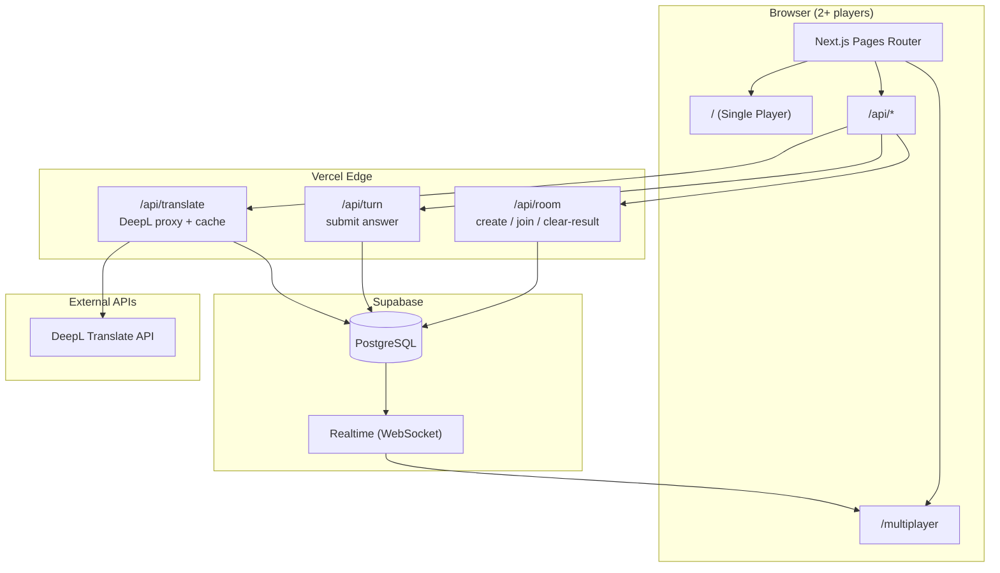
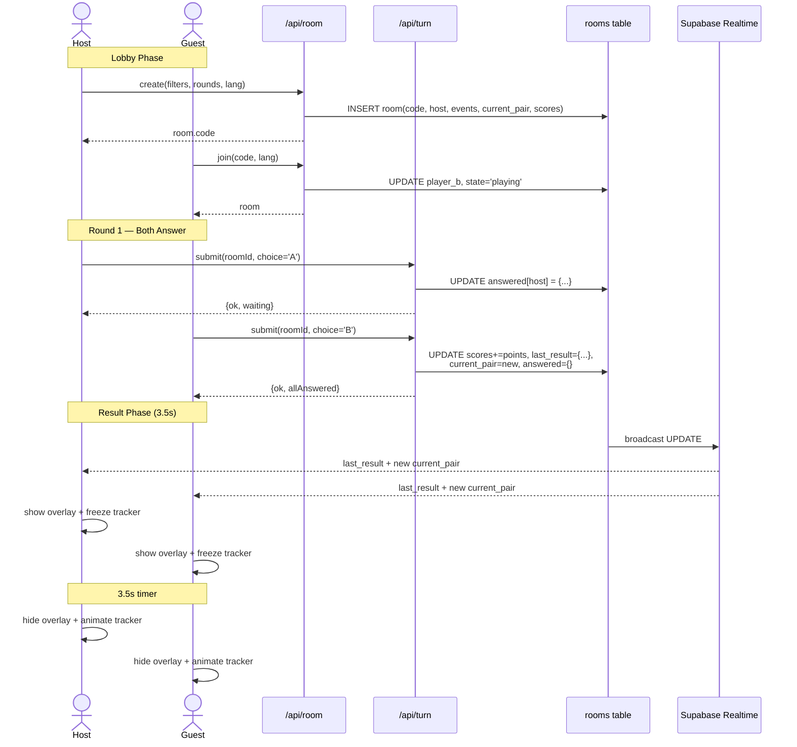
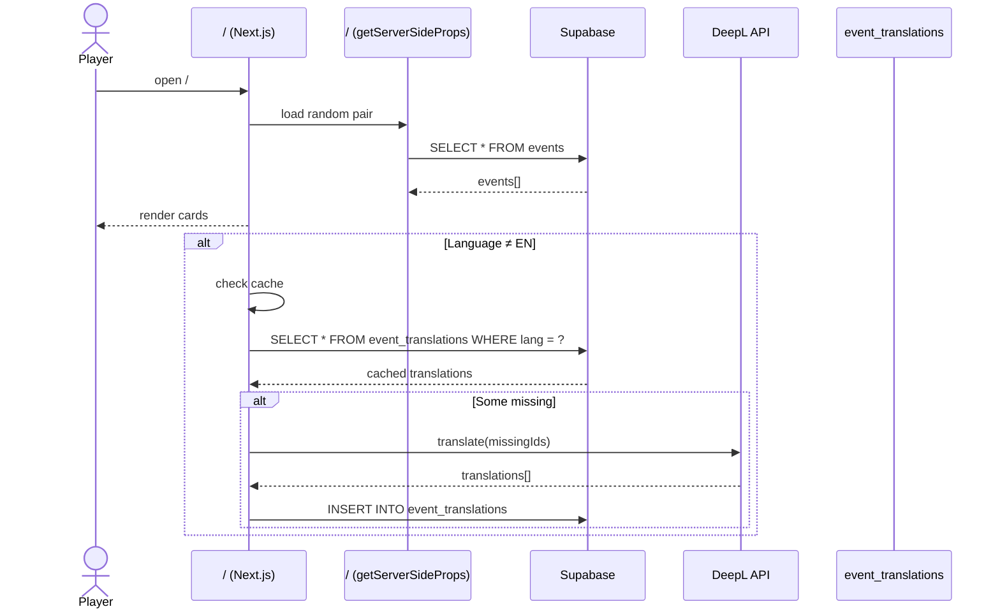
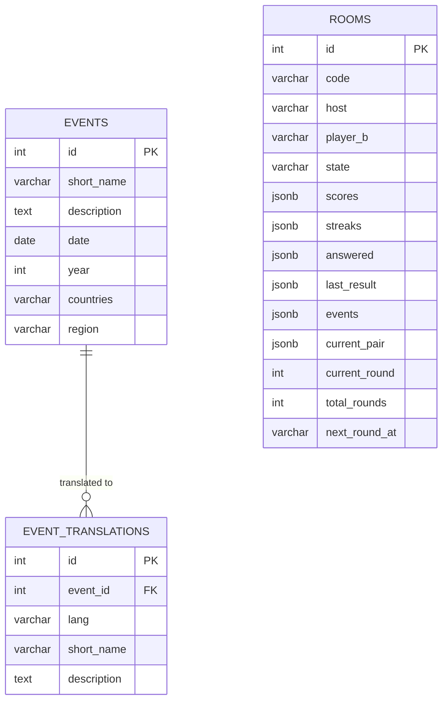
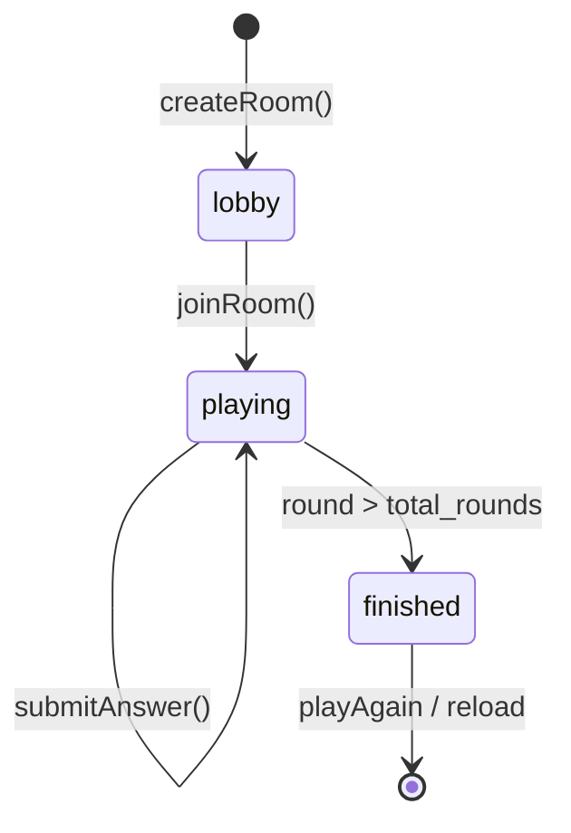
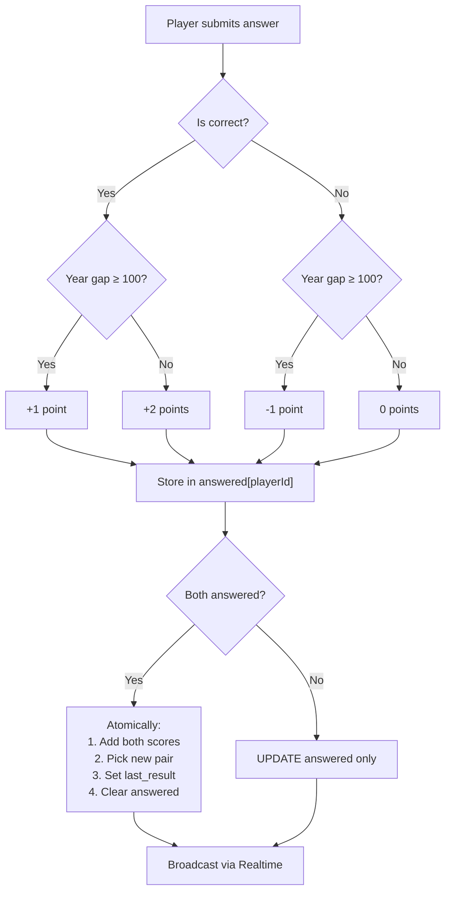
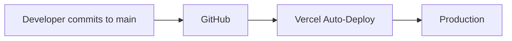

# History Game — Architecture

## System Overview



---

## Multiplayer Data Flow



---

## Single-Player Data Flow



---

## Database Schema



---

## Room State Machine



---

## Turn.js Scoring Logic



---

## File Structure

```
pages/
├── index.js              # Single-player game
├── multiplayer.js        # Multiplayer lobby + game UI
├── api/
│   ├── room.js           # create / join / clear-result
│   ├── turn.js           # submit answer + calculate score
│   └── translate.js      # DeepL proxy + Supabase cache
```

---

## Environment Variables

| Variable | Scope | Purpose |
|----------|-------|---------|
| `NEXT_PUBLIC_SUPABASE_URL` | Client + Server | Supabase project URL |
| `NEXT_PUBLIC_SUPABASE_KEY` | Client + Server | Supabase anon key (safe for client) |
| `SUPABASE_SERVICE_ROLE_KEY` | Server only | Full DB access for APIs |
| `DEEPL_API_KEY` | Server only | DeepL authentication |

---

## Deployment Pipeline

