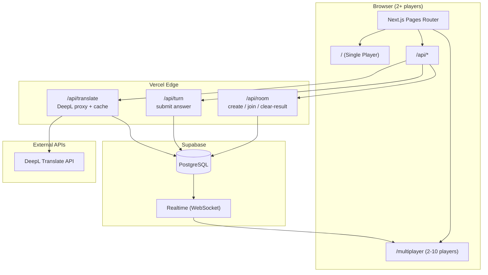
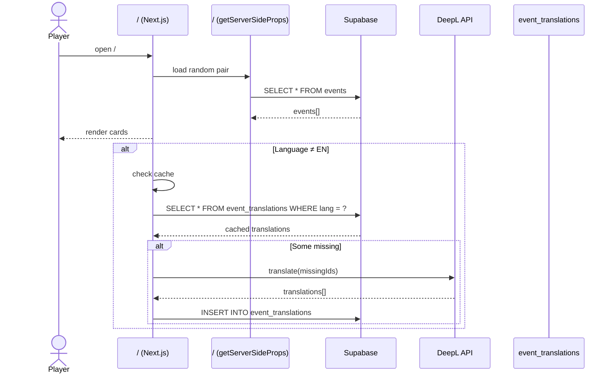
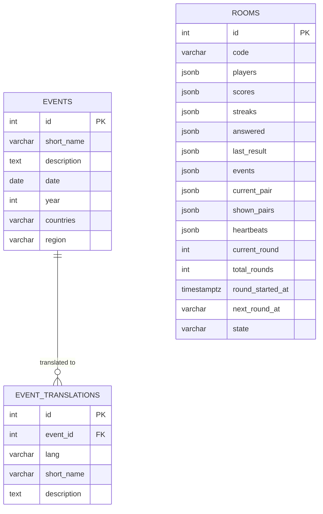
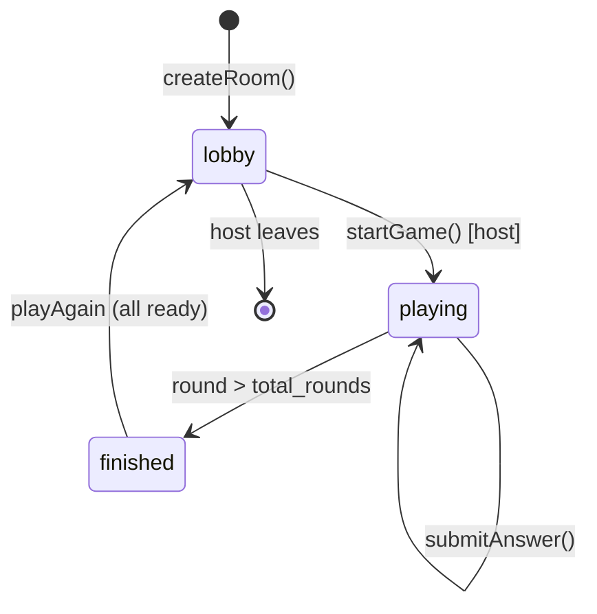
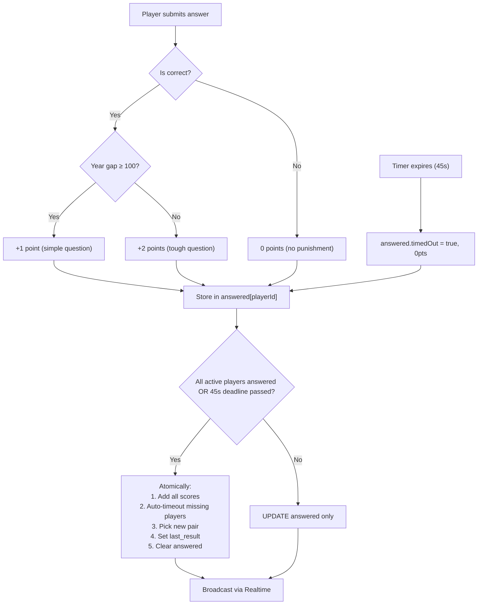
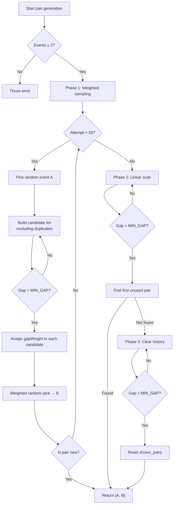
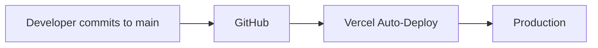

# History Game — Architecture

## System Overview



---

## Multiplayer Data Flow


```

---

## Single-Player Data Flow



---

## Database Schema



---

## Room State Machine



---

## Turn.js Scoring Logic



| Scenario | Year Gap | Correct Points | Wrong Points | Timed Out |
|----------|----------|---------------|--------------|-----------|
| Simple question | ≥ 100 years | +1 | **0** | **0** |
| Tough question | < 100 years | +2 | **0** | **0** |

---

## Event Pairing Algorithm (`pickPair.js`)

The game generates pairs of historical events for each round. Events that are **closer in time** are preferred, but with a **hard minimum gap of 10 years** — events 10 years apart or less are completely excluded from pairing. This prevents ambiguous "too-close-to-call" rounds while still favoring challenging nearby dates over easy distant ones.

### Minimum Gap Rule

```
MIN_GAP_YEARS = 10
```

Any candidate event where `gapYears ≤ 10` is **rejected immediately** before weight calculation. This applies to **all three** generation phases (weighted sampling, linear scan fallback, and nuclear fallback).

### Weight Function

After filtering out gaps ≤ 10 years, the selection uses a **proximity-weighted random sample**. The weight for a remaining candidate is:

```
weight = 1 / (1 + gapYears / 100)
```

Where `gapYears` is the absolute difference in years between the two events.

### Weight Examples

| Year Gap | Weight | Relative Likelihood | Eligible? |
|----------|--------|---------------------|-----------|
| 5 years  | 0.667  | 2.0x vs 20-year gap | ❌ Rejected (≤10) |
| 10 years | 0.500  | 1.5x vs 20-year gap | ❌ Rejected (≤10) |
| 11 years | 0.476  | 1.4x vs 20-year gap | ✅ Yes |
| 20 years | 0.333  | baseline | ✅ Yes |
| 50 years | 0.167  | 0.5x vs 20-year gap | ✅ Yes |
| 100 years| 0.091  | 0.27x vs 20-year gap | ✅ Yes |
| 200 years| 0.048  | 0.14x vs 20-year gap | ✅ Yes |
| 500 years| 0.020  | 0.06x vs 20-year gap | ✅ Yes |

**Key property:** now that the 0–10 year range is excluded, the effective "sweet spot" shifts to 11–50 year gaps. A 20-year gap is the new most-likely baseline, making most rounds challenging (+2 points) while still allowing occasional simpler 100+ year pairs.

### Pair Generation Flow



### Deduplication (`shown_pairs`)

Each room stores a `shown_pairs` JSONB array in the `rooms` table. It contains canonical string keys of every pair already shown, formatted as:

```
canonicalKey(idA, idB) = `${min(idA, idB)}-${max(idA, idB)}`
```

This guarantees:
- No repeated questions in a single game
- Deterministic key regardless of which event is "A" or "B"
- Automatic reset when all valid pairs are exhausted (nuclear fallback)

The single-player game also uses `pickPair` with an in-memory `Set` (reset on each new game via "Start Game") for the same anti-repeat behaviour.

### Why Proximity Weighting + Minimum Gap?

| Without any weighting | With proximity weighting only | With weighting + 10-year MIN_GAP |
|-------------------|----------------|---------------------------------|
| Random pairs → many 500+ year gaps | Most pairs are 20–100 years apart | Most pairs are **11–50 years** apart |
| Players get bored from easy +1 rounds | More challenging +2 rounds | **Even more** +2 rounds |
| Occasional 2-year ambiguity | 0–10 year ambiguities possible | **Zero ambiguity** — every round is decidable |
| Low skill differentiation | Tighter scores | Tighter scores + clearer answers |

---

## File Structure

```
pages/
├── index.js              # Single-player game
├── multiplayer.js        # Multiplayer lobby (2-10 players) + game UI + leaderboard
├── api/
│   ├── room.js           # create / join / update-profile / start / restart / leave / heartbeat
│   ├── turn.js           # submit answer + calculate score + 45s deadline
│   ├── finish.js         # force finish + build full standings
│   └── translate.js      # DeepL proxy + Supabase cache
lib/
├── pickPair.js           # Shared pair generation (proximity-weighted + dedup, MIN_GAP_YEARS=10)
└── eventTime.js          # Shared getEventYear() / getEventTime() — single source of truth for event dating
```

---

## Environment Variables

| Variable | Scope | Purpose |
|----------|-------|---------|
| `NEXT_PUBLIC_SUPABASE_URL` | Client + Server | Supabase project URL |
| `NEXT_PUBLIC_SUPABASE_KEY` | Client + Server | Supabase anon key (safe for client) |
| `SUPABASE_SERVICE_ROLE_KEY` | Server only | Full DB access for APIs |
| `DEEPL_API_KEY` | Server only | DeepL authentication |

---

## Deployment Pipeline

